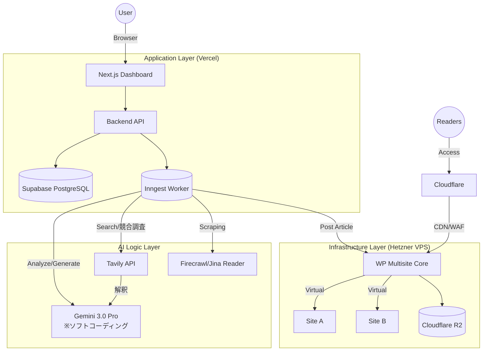

# 00. アーキテクチャ - マスタードキュメント

> **関連ドキュメント:** [開発ロードマップ](../DEVELOPMENT_ROADMAP.md) | [コンセプト決定](../CONCEPT_DECISIONS.md) | [WordPress Multisiteガイド](./07_WordPress_Multisite_Guide.md) | [全フェーズ一覧](../phases/)

## 概要

**Argo Note** の技術スタックとアーキテクチャ構造を定義するマスタードキュメントです。
本プロジェクトは、**「バイブコーディング時代の放置OKブログ自動運用SaaS」**です。

**サービスコンセプト:** "Your AI-Powered Blog. Fully Automated."

**核心的価値:**
- バイブコーディングで生まれたプロダクトの集客を自動化
- 最小限の入力で、WordPressブログのセットアップから記事生成・公開・運用まで一気通貫
- 「放置OK」の体験を技術的に担保

**MVP期限:** 2026年2月25日（1ヶ月）| **月額予算:** $100以内

## アーキテクチャ基本方針

1.  **疎結合と責務の分離 (Separation of Concerns):**
    - 管理画面・バックエンドAPI（アプリケーション層）と、実際にブログが稼働するWordPressサーバー（インフラ層）を明確に分離します。
    - これにより、個々のWordPressサイトの負荷がシステム全体に波及するのを防ぎ、セキュリティリスクも隔離します。
2.  **APIファースト:**
    - 全ての操作はAPI経由で行えるように設計し、将来的なモバイルアプリ化や外部連携に備えます。
3.  **資産性・可搬性の担保:**
    - WordPress Multisite構成を採用。標準のXMLエクスポートやMigrationプラグインにより「他社へ移管」が技術的に容易な構造にします（Exit戦略）。
    - 詳細は[Multisite実装可能性調査](./06_Multisite_feasibility.md)を参照。

## 構成要素一覧と詳細ドキュメント

全体の構造は以下の4つの領域に分割して詳細を検討します。

### [01. フロントエンド・アプリケーション層](./01_Frontend_Architecture.md)

ユーザーが触れる管理画面（ダッシュボード）と、バックエンドAPIサーバーの設計です。

- **Tech Stack:** Next.js 14 (App Router), TypeScript, Tailwind CSS, Shadcn/UI
- **Host:** Vercel
- **Auth:** **Supabase Auth**（Google OAuth対応）

### [02. バックエンドAPI・データベース層](./02_Backend_Database.md)

ビジネスロジック、データ永続化、ジョブ管理を担う層です。

- **API:** Next.js API Routes, Prisma ORM
- **Database:** **Supabase (PostgreSQL)** + MariaDB (WordPress)
- **Worker:** **Inngest**（長時間処理・自動リトライ）
- **Token暗号化:** AES-256-GCM

### [03. インフラ・WordPress実行層](./03_Infrastructure_Ops.md)

実際にユーザーのブログが稼働する環境です。本サービスの心臓部です。

- **Platform:** **Hetzner VPS** → [選定理由](./11_VPS_Provider_Selection.md)
- **Architecture:** **WordPress Multisite**（100サイトまで単一VPS）→ [詳細ガイド](./07_WordPress_Multisite_Guide.md)
- **Network/Security:** Cloudflare（詳細下記）
- **Storage:** **Cloudflare R2**（メディアファイル）
- **Monitoring:** UptimeRobot, Sentry

#### Cloudflare利用サービス一覧

| サービス | 用途 | プラン |
|---------|------|--------|
| **Cloudflare DNS** | ドメイン管理、サブドメインルーティング | Free |
| **Cloudflare CDN** | 静的ファイルキャッシュ、グローバル配信 | Free |
| **Cloudflare SSL** | ワイルドカードSSL証明書（*.argonote.app） | Free |
| **Cloudflare WAF** | DDoS対策、Web攻撃防御、Bot対策 | Free |
| **Cloudflare R2** | メディアファイルストレージ（エグレス無料） | 従量課金 |
| **Cloudflare Proxy** | リバースプロキシ、オリジンIP秘匿 | Free |

**注:** 全てCloudflareのFreeプランで対応可能。R2のみ従量課金（10GB/月無料枠あり）。

### [04. AIパイプライン・ジョブシステム](./04_AI_Pipeline.md)

記事生成、分析、画像生成を行う非同期処理フローです。

**SEO戦略駆動型7フェーズパイプライン:**

| Phase | 処理 | ツール |
|-------|------|--------|
| A | プロダクト理解 | Firecrawl / Jina Reader / LLM対話 |
| B | 購買思考推論 | LLM |
| C | キーワード調査 | Keywords Everywhere / DataForSEO |
| D | 競合/SERP分析 | Tavily + LLM |
| E | 記事クラスター設計 | LLM |
| F | 個別記事生成 | Gemini 3.0 Pro |
| G | パフォーマンス最適化 | GSC連携（Phase 10） |

- **Text Gen:** **Gemini 3.0 Pro**（LiteLLMプロキシ経由、ソフトコーディング）
- **Search/競合調査:** **Tavily API** → LLM解釈
- **Keyword Research:** Keywords Everywhere / DataForSEO（Phase C）
- **Scraping:** **Firecrawl + Jina Reader**（フォールバック）
- **Image:** **Nanobana Pro**
- **Scheduler:** **Inngest**（スケジュール自動化）
- **Prompt Intelligence:** Phase 15で効果分析・A/Bテスト

**重要:** LLMモデルはソフトコーディング（環境変数で切り替え可能）とする。ハードコード禁止。

---

## 全体アーキテクチャ図（概略）

---

## 開発フェーズとの関連

本アーキテクチャは以下のフェーズで実装されます。詳細は[開発ロードマップ](../DEVELOPMENT_ROADMAP.md)を参照。

| フェーズ | 関連するアーキテクチャ要素 | Week |
|---------|--------------------------|------|
| [Phase 0: Mockup](../phases/Phase0_Mockup.md) | SNSデモ動画・コンセプト検証 | 1前半 |
| [Phase 0.5: MVP Branding](../phases/Phase0.5_MVPBranding.md) | ロゴ・アイコン・正式LP | 1前半 |
| [Phase 1: Infrastructure + Auth](../phases/Phase1_Infrastructure.md) | VPS、Multisite、Supabase Auth | 1 |
| [Phase 2: Core AI](../phases/Phase2_CoreAI.md) | AIパイプライン、Inngest | 2 |
| [Phase 3: User Interface](../phases/Phase3_UserInterface.md) | Next.js Dashboard | 3 |
| [Phase 4: Automation](../phases/Phase4_Automation.md) | スケジュール自動化 | 3 |
| [Phase 5: Monetization](../phases/Phase5_Monetization.md) | Stripe連携 | 4 |
| [Phase 6: MVP Launch](../phases/Phase6_MVPLaunch.md) | Beta運用開始 | 4 |

**成長フェーズ（Phase 7-15）:** [開発ロードマップ](../DEVELOPMENT_ROADMAP.md) を参照
- Phase 10: GSC Integration（パフォーマンスデータ取得）
- **Phase 15: Prompt Intelligence**（プロンプト効果分析・A/Bテスト）
