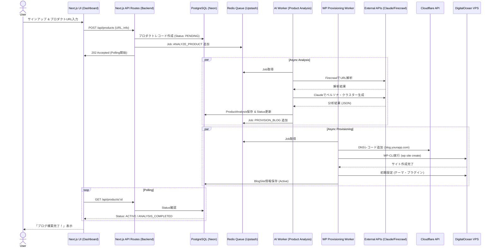
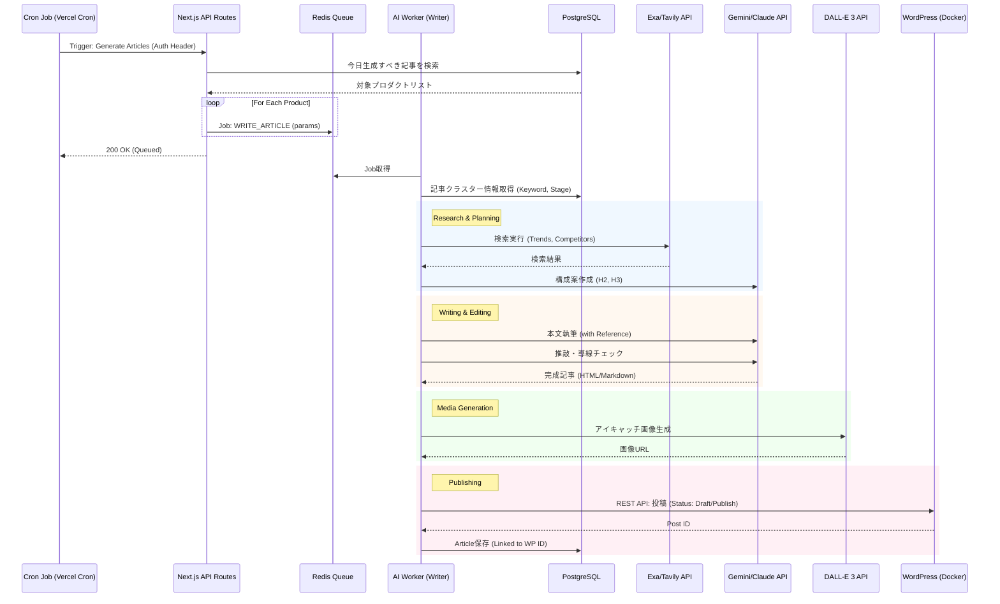

# 05. シーケンス図 (Sequence Diagrams)

本システムにおける主要なワークフローの処理シーケンスを定義します。

## 1. ユーザー登録〜プロダクト分析〜ブログ構築フロー

ユーザーがサインアップし、プロダクトURLを入力してから、ブログが実際に立ち上がるまでの流れです。
ここではAPIサーバーが「コントローラー」として振る舞い、重い処理はQueue経由でWorkerにオフロードしています。

## 2. 記事自動生成・投稿フロー (Daily Loop)

毎日定期的に実行される、またはユーザー定義スケジュールに基づいて実行されるフローです。
ここでもAPIはトリガーのみを行い、実際の生成は非同期で行います。

## 3. ミドルエンドに関する補足 (Architecture Decision)

ユーザー様からのご質問「ミドルエンドは配置しないのか？」に対する回答とアーキテクチャの意図です。

### 現状の構成

Next.js (App Router) の **API Routes (Server Actions)** が実質的な「ミドルエンド（BFF: Backend For Frontend）」の役割を果たします。

- **Security:** 環境変数（API Key等）はサーバー側で保持され、クライアントには露出しません。認証（Auth）もここでガードします。
- **Performance:** VercelのEdge Network上で動作し、レイテンシを最小化します。
- **Logic:** 軽いビジネスロジックはここに記述します。

### なぜ独立したミドルエンドサーバー（Go/Node.js単体など）を置かないのか？

1.  **開発スピード (Time to Market):**
    - フロントエンドとバックエンドを単一の言語（TypeScript）、単一のフレームワーク（Next.js）で管理することで、型定義の共有やデプロイの簡略化が可能になり、MVP開発における圧倒的な速度向上に寄与します。
2.  **インフラ複雑性の排除:**
    - 独立したAPIサーバーを立てると、そのサーバーの管理、スケーリング、ロードバランシングが必要になります。Serverless (Vercel) に任せることで、インフラ管理コストをゼロにします。
3.  **非同期処理への委譲:**
    - 本サービスの重い処理（AI生成、WP構築）は、即時応答が必要なAPIサーバーではなく、**Worker（非同期ワーカー）** に任せる設計です。
    - したがって、APIサーバー自体はリクエストを受け付けてQueueに入れるだけの「軽量な」役割に徹するため、Node.js (Next.js API) で十分なパフォーマンスが出ます。

### 将来的な拡張

もし将来的に複雑なステートフルな処理（WebSocketの大量接続など）が必要になった場合や、エンタープライズ向けの厳格なマイクロサービス化が必要になった段階で、GoやRustによる独立したバックエンドサービスの導入を検討します。
現在のMVP〜グロースフェーズにおいては、**Next.js API Routes + Worker** の構成が最適解（オーバーエンジニアリングを避ける）と判断しました。
