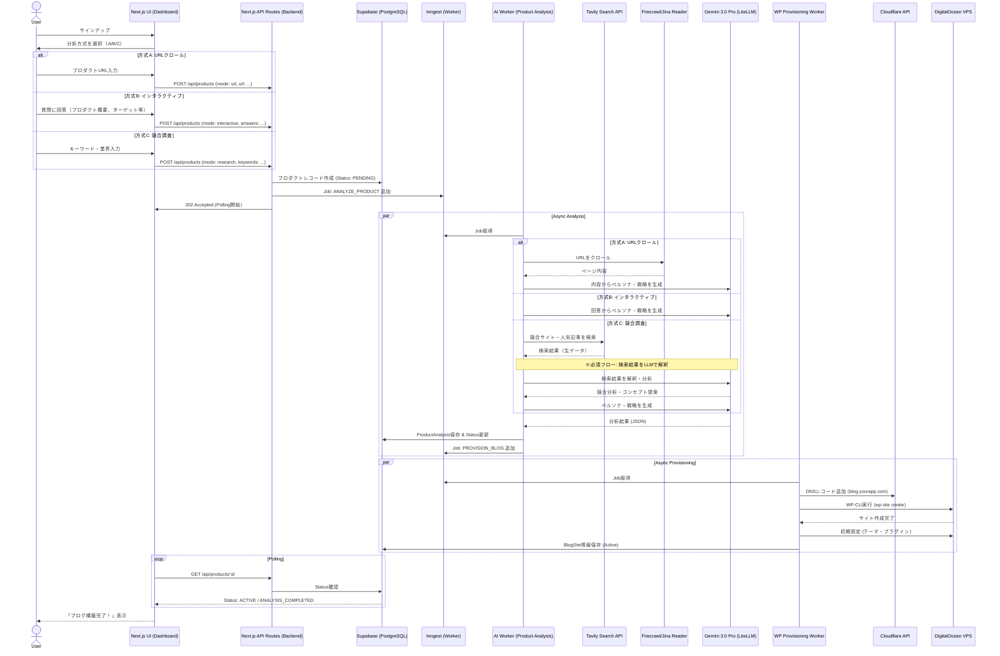
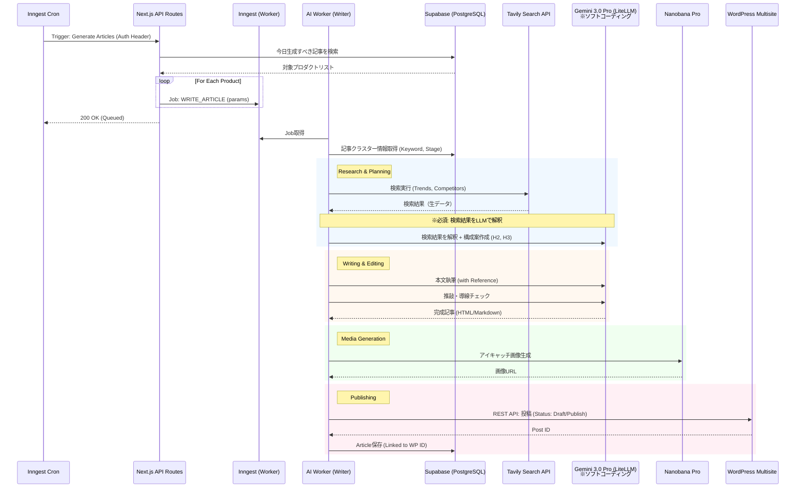

# 05. シーケンス図 (Sequence Diagrams)

> **サービス名:** Argo Note
> **関連ドキュメント:** [開発ロードマップ](../DEVELOPMENT_ROADMAP.md) | [コンセプト決定](../CONCEPT_DECISIONS.md) | [マスターアーキテクチャ](./00_Master_Architecture.md) | [AIパイプライン](./04_AI_Pipeline.md)

本システムにおける主要なワークフローの処理シーケンスを定義します。

## 1. ユーザー登録〜プロダクト分析〜ブログ構築フロー

ユーザーがサインアップし、プロダクト情報を入力してから、ブログが実際に立ち上がるまでの流れです。
**プロダクト分析は複数の入力方式に対応**しており、ユーザーの状況に応じて選択できます。

### プロダクト分析の入力方式

| 方式 | 対象ユーザー | 入力内容 |
|------|-------------|----------|
| **A. URLクロール** | 明確なプロダクトサイトがある | URLを貼り付け → Firecrawl/Jina Readerで情報取得 |
| **B. インタラクティブ** | プロダクトが未確定/開発中 | 質問に回答 → LLMが整理 |
| **C. 競合調査** | 市場参入を検討中 | キーワード入力 → Tavily検索 → LLM解釈 |

**重要:** 方式Cでは、Tavily Search API → LLM解釈 のフローが**必須**です。

**MVP採用方式の決定プロセス:** AのURLクロールMockup と BのインタラクティブQ&A Mockup を作成し、XなどのSNSで映像を配信して反応を比較し、どちらが市場に求められているかを検証した上で採用方式を決定する。方式Cは本テスト対象外で、扱いは別途決定する。

## 2. 記事自動生成・投稿フロー (Daily Loop)

毎日定期的に実行される、またはユーザー定義スケジュールに基づいて実行されるフローです。
ここでもAPIはトリガーのみを行い、実際の生成は非同期で行います。

## 3. ミドルエンドに関する補足 (Architecture Decision)

ユーザー様からのご質問「ミドルエンドは配置しないのか？」に対する回答とアーキテクチャの意図です。

### 現状の構成

Next.js (App Router) の **API Routes (Server Actions)** が実質的な「ミドルエンド（BFF: Backend For Frontend）」の役割を果たします。

- **Security:** 環境変数（API Key等）はサーバー側で保持され、クライアントには露出しません。認証（Auth）もここでガードします。
- **Performance:** VercelのEdge Network上で動作し、レイテンシを最小化します。
- **Logic:** 軽いビジネスロジックはここに記述します。

### なぜ独立したミドルエンドサーバー（Go/Node.js単体など）を置かないのか？

1.  **開発スピード (Time to Market):**
    - フロントエンドとバックエンドを単一の言語（TypeScript）、単一のフレームワーク（Next.js）で管理することで、型定義の共有やデプロイの簡略化が可能になり、MVP開発における圧倒的な速度向上に寄与します。
2.  **インフラ複雑性の排除:**
    - 独立したAPIサーバーを立てると、そのサーバーの管理、スケーリング、ロードバランシングが必要になります。Serverless (Vercel) に任せることで、インフラ管理コストをゼロにします。
3.  **非同期処理への委譲:**
    - 本サービスの重い処理（AI生成、WP構築）は、即時応答が必要なAPIサーバーではなく、**Worker（非同期ワーカー）** に任せる設計です。
    - したがって、APIサーバー自体はリクエストを受け付けてQueueに入れるだけの「軽量な」役割に徹するため、Node.js (Next.js API) で十分なパフォーマンスが出ます。

### 将来的な拡張

もし将来的に複雑なステートフルな処理（WebSocketの大量接続など）が必要になった場合や、エンタープライズ向けの厳格なマイクロサービス化が必要になった段階で、GoやRustによる独立したバックエンドサービスの導入を検討します。
現在のMVP〜グロースフェーズにおいては、**Next.js API Routes + Worker** の構成が最適解（オーバーエンジニアリングを避ける）と判断しました。
